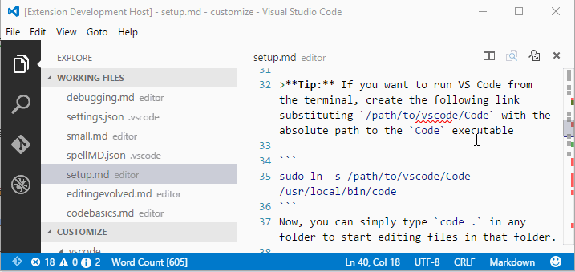

# README

This extension does the following:

## WordCount File Watcher
Whenever a `markdown` file is loaded a status bar message is added which includes the current word count - this live updates as you type and move from file to file:

### Issues: Word Count
the events for opening and closing a file don't seam to fire predictably:

Repro:

1. run extension
2. open a folder w/ moced filed
3. open a `.md` file status bar _may_ activate
4. once activzated navigate to another file e.g. `.js`
5. status bar stay stay active
6. navigate to another `.md` status bar will probably activate but may have a stale count

## Keybinding 'Alt+T' - Text Tools
Also available as `command`.

Hit `Alt+T` to get some text replacement tools e.g.

* toUpper
* toLower
* Reverse
* HTML Encode
* ..

Will replace all selections in the current editor.

### Issues: Ugly Code
Lots of copy and paste can abstract [my] common code.

### Issues: Encode HTML
This function will replace the selection(s) with more text than they had orriginally e.g.

* `hello 
 world`
* Results in `hello &gt;div&lt; world`

In the code I attempt to handle this with some simple re-writing of the selection range from the replacement `txt.length`.  However the resulting selection is much longer.  

Repro:

1. Open a doc
2. select some text w/ html in it
3. `Alt+T' select Encode HTML
4. Resulting selection will be to long and the status bar indication of 'selected' will be incorrect

I see some debug style output in the console for sections as well.