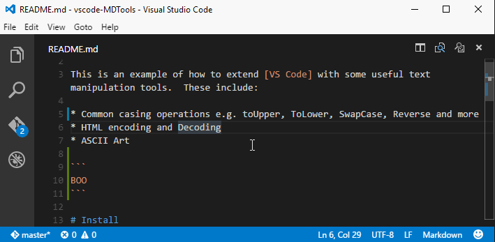

# Functionality

This is an example of how to extend [VS Code](https://github.com/Microsoft/vscode) with some useful text manipulation tools.  This extension works for all file types.

These include:

* Common casing operations e.g. toUpper, ToLower, SwapCase, Reverse and more
* HTML encoding and Decoding
* ASCII Art

# Install

Open up VS Code and hit `F1` and type `ext` select Install Extension and type `mdtools` hit enter and reload window to enable. 

# Update a selection

The extension is activated for all file types, and  you open up a menu of commands by pressing `Alt+T`. Multi selection is supported for all commands. If you select ASCII Art you will get a secondary menu where you can choose the font.

# Known Issues

Here are a few common issues.

* The selection zone post edit can be mis-mapped.

# Updates

## 1.0.0

* Fixed some multi selection bugs
    * fix: ASCII Art, toUpper, ToLower all now support multi-selection
* Added in a few more options
    * Slugify
    * Camelize
 
